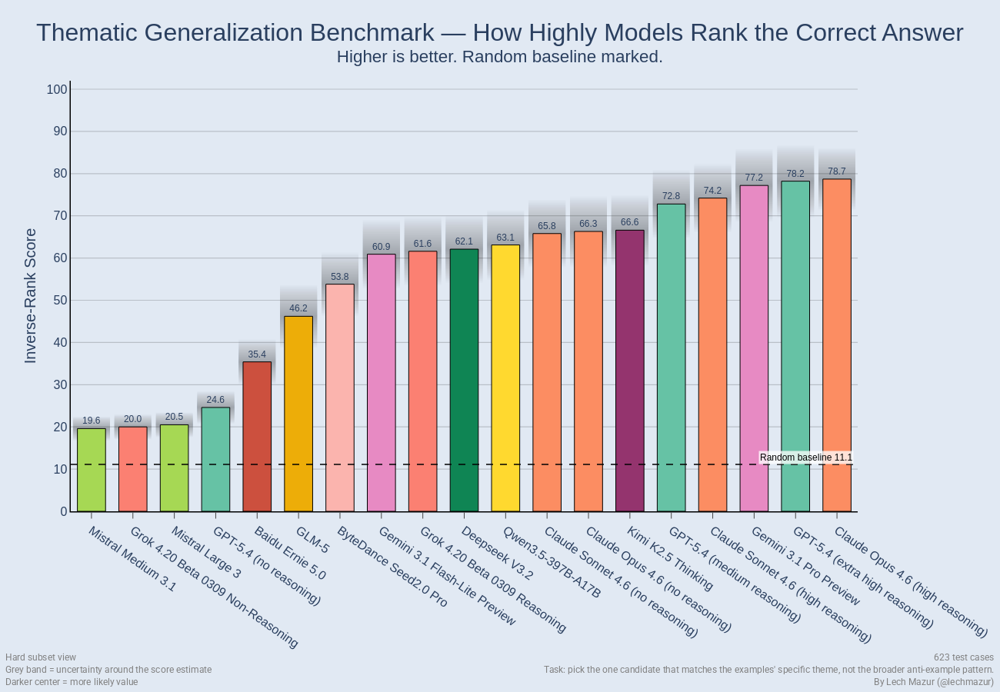
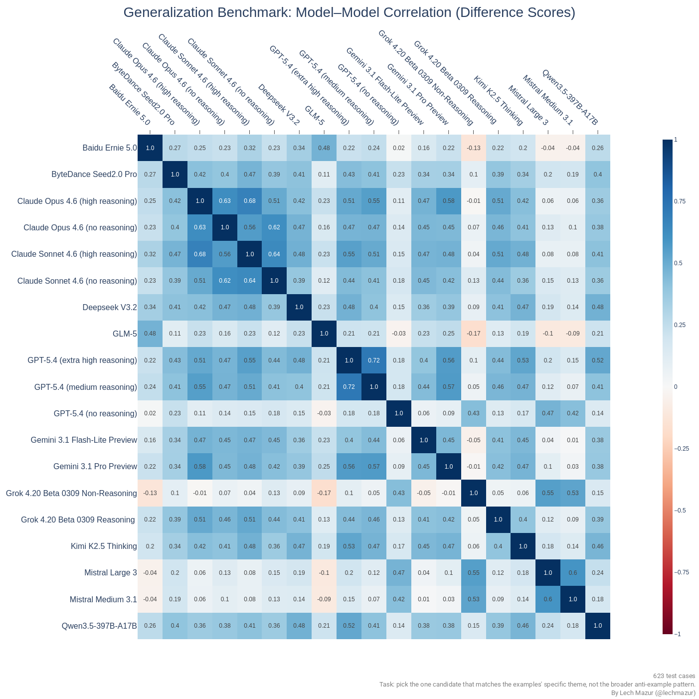

# LLM Thematic Generalization Benchmark V2

This benchmark tests whether large language models can infer a **specific latent theme** from a few examples, use anti-examples to reject the broader but wrong pattern, and then identify the **one true match** among close distractors.

Each item gives the model:
- **3 positive examples**
- **3 anti-examples** that fit a broader or adjacent pattern but not the exact one
- **8 candidates**, with exactly **1** hidden true match

Models score all 8 candidates. We then measure whether the correct candidate is ranked first, and how highly it tends to be ranked overall.

V2 uses **1,247 validated prompts** and adds stricter ambiguity filtering plus harder evaluation slices. The previous published release is being archived as V1.

---

## Headline Result: Cross-Family Hard Subset

This is the main result.

The chart uses **inverse-rank score**, a higher-is-better transformation of the average rank assigned to the correct answer. It is easier to interpret than raw average rank and avoids the old problem where a random model would sit around the middle of the scale.

The subset contains **623** items where at least **two distinct full-coverage model buckets** miss the item. A case does not enter this subset just because two nearby variants from the same family fail; it needs broader model disagreement.

### Cross-family hard-subset leaderboard

| Rank | Model | Top-1 Accuracy | Inverse-Rank Score | Cases |
|---:|---|---:|---:|---:|
| 1 | Claude Opus 4.6 (high reasoning) | 88.9% | 78.7 | 623 |
| 2 | GPT-5.4 (extra high reasoning) | 89.9% | 78.2 | 623 |
| 3 | Gemini 3.1 Pro Preview | 90.4% | 77.2 | 623 |
| 4 | Claude Sonnet 4.6 (high reasoning) | 87.2% | 74.2 | 623 |
| 5 | GPT-5.4 (medium reasoning) | 86.8% | 72.8 | 623 |
| 6 | Kimi K2.5 Thinking | 82.8% | 66.6 | 623 |
| 7 | Claude Opus 4.6 (no reasoning) | 82.5% | 66.3 | 623 |
| 8 | Claude Sonnet 4.6 (no reasoning) | 80.4% | 65.8 | 623 |
| 9 | Qwen3.5-397B-A17B | 80.7% | 63.1 | 623 |
| 10 | Deepseek V3.2 | 79.6% | 62.1 | 623 |
| 11 | Grok 4.20 Beta 0309 Reasoning | 79.6% | 61.6 | 623 |
| 12 | Gemini 3.1 Flash-Lite Preview | 80.4% | 60.9 | 623 |
| 13 | ByteDance Seed2.0 Pro | 74.2% | 53.8 | 623 |
| 14 | GLM-5 | 73.2% | 46.2 | 623 |
| 15 | Baidu Ernie 5.0 | 58.3% | 35.4 | 623 |
| 16 | GPT-5.4 (no reasoning) | 39.0% | 24.6 | 623 |
| 17 | Mistral Large 3 | 28.1% | 20.5 | 623 |
| 18 | Grok 4.20 Beta 0309 Non-Reasoning | 29.2% | 20.0 | 623 |
| 19 | Mistral Medium 3.1 | 33.5% | 19.6 | 623 |

Main takeaway:
- the frontier cluster is tight
- weaker non-reasoning systems fall off sharply

---

## Model-Behavior Correlation

This heatmap compares model behavior at the item level on the same hard subset.

Models that tend to score the same prompts similarly cluster together, while more unusual models sit further away from the pack. This is useful because raw leaderboard position is only part of the story: two models can have similar overall scores while making different kinds of mistakes.

---

## Example Benchmark Item

Here is a representative V2-style example:

**Examples**
- a surveyor's leveling rod
- a fishpole microphone boom
- a submarine periscope housing

**Anti-examples**
- a coiled steel measuring tape
- a folding wooden carpenter's rule
- a retractable cord dog leash

**Correct candidate**
- a collapsible stainless steel drinking straw

**Theme**
- physical objects that extend and retract by sliding rigid, nested tubular segments along a single axis

This shows the core idea of the benchmark:
- the model must infer a **narrow mechanism**, not just a broad category like "things that extend"
- the anti-examples are deliberately close enough to tempt a broader but wrong rule
- the correct answer is only obvious if the model identifies the precise latent theme

---

## Method Summary

### 1. Theme generation

Multiple strong LLMs generate candidate themes from random seeds. These themes are meant to be narrow, specific, and checkable rather than broad trivia categories.

### 2. Examples and anti-examples

For each theme, models generate:
- true examples that fit the exact theme
- anti-examples that fit a broader or neighboring pattern but not the exact one

### 3. Double-checking

Generated examples and anti-examples are reviewed by other models. Weak or internally inconsistent items are removed.

### 4. Validation

The benchmark runs explicit validation prompts that ask models to:
- check whether the true candidate matches the stated theme
- infer alternate themes from the examples
- detect cases where the candidate pack is too ambiguous

V2 adds a stricter ambiguity / exclusivity screen here.

### 5. Final pick task

Each benchmark prompt shows:
- 3 examples
- 3 anti-examples
- 8 candidates

Exactly one candidate is the hidden fourth true example. Models score all 8 candidates, and the results are turned into leaderboard metrics.

---

## Related Benchmarks

- [Sycophancy Benchmark](https://github.com/lechmazur/sycophancy/)
- [Writing Benchmark](https://github.com/lechmazur/writing/)
- [Translation Benchmark](https://github.com/lechmazur/translation/)
- [PACT: Multi-Round Bargaining Benchmark](https://github.com/lechmazur/pact/)
- [BAZAAR: Auction Market Benchmark](https://github.com/lechmazur/bazaar/)
- [Extended NYT Connections](https://github.com/lechmazur/nyt-connections/)
- [Step Game](https://github.com/lechmazur/step_game/)
- [Elimination Game](https://github.com/lechmazur/elimination_game/)
